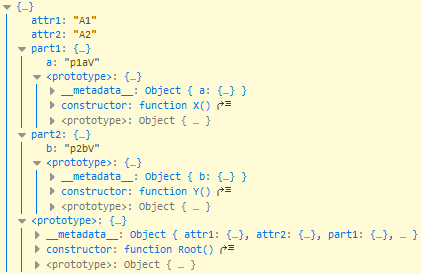

# xtyped-serializer
XsdSchema-aware XML serializer for TypeScript 

Having such a schema
```
<?xml version="1.0" encoding="utf-8" ?>
<xs:schema xmlns:xs="http://www.w3.org/2001/XMLSchema">

  <xs:element name="nx">
    <xs:complexType>
      <xs:sequence>
        <xs:element name="part1" type="X" />
        <xs:element name="part2" type="Y" />
      </xs:sequence>
      <xs:attribute name="attr1" type="xs:string" />
      <xs:attribute name="attr2" type="xs:string" />
    </xs:complexType>
  </xs:element>

  <xs:complexType name="X">
    <xs:attribute name="a" type="xs:string" />
  </xs:complexType>

  <xs:complexType name="Y">
    <xs:attribute name="b" type="xs:string" />
  </xs:complexType>

</xs:schema>
```
Mapped to the classes and deserializing a compiant XML
```
import {XmlRoot, XmlAttribute, XmlElement, XmlComplexType} from 'xtyped-serializer/annotations';
import xs from 'xtyped-serializer/serializer'

@XmlComplexType()
class X {
  @XmlAttribute()
  a: string;
}

@XmlComplexType()
class Y {
  @XmlAttribute()
  b: string;
}

@XmlRoot({name: 'nx'})
class Root extends Base {
  @XmlAttribute()
  attr1: string;
  @XmlAttribute()
  attr2: string;

  @XmlElement({order: 1, name: 'part1', type: {ctor: ()=>X}})
  part1: X;
  @XmlElement({order: 2, name: 'part2', type: {ctor: ()=>Y}})
  part2: Y;
}


const xmlText = `<nx attr1="A1" attr2="A2">
                    <part1 a="p1aV" />
                    <part2 b="p2bV" />
                 </nx>`;

const o = xs.deserialize(xmlText, Root);

console.warn(o);

```
The result would be correctly typed and instantiated object tree:



